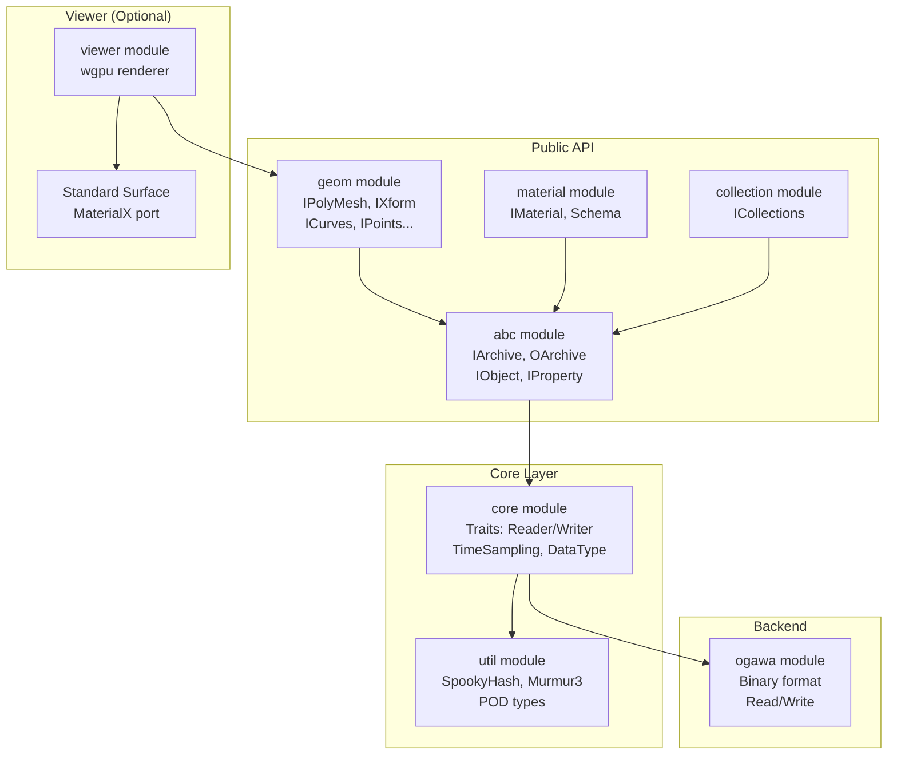
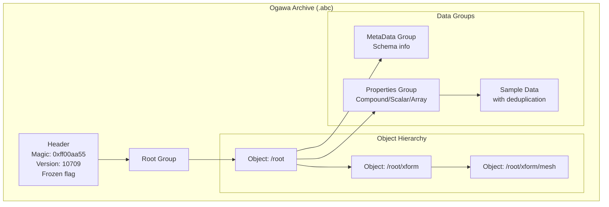
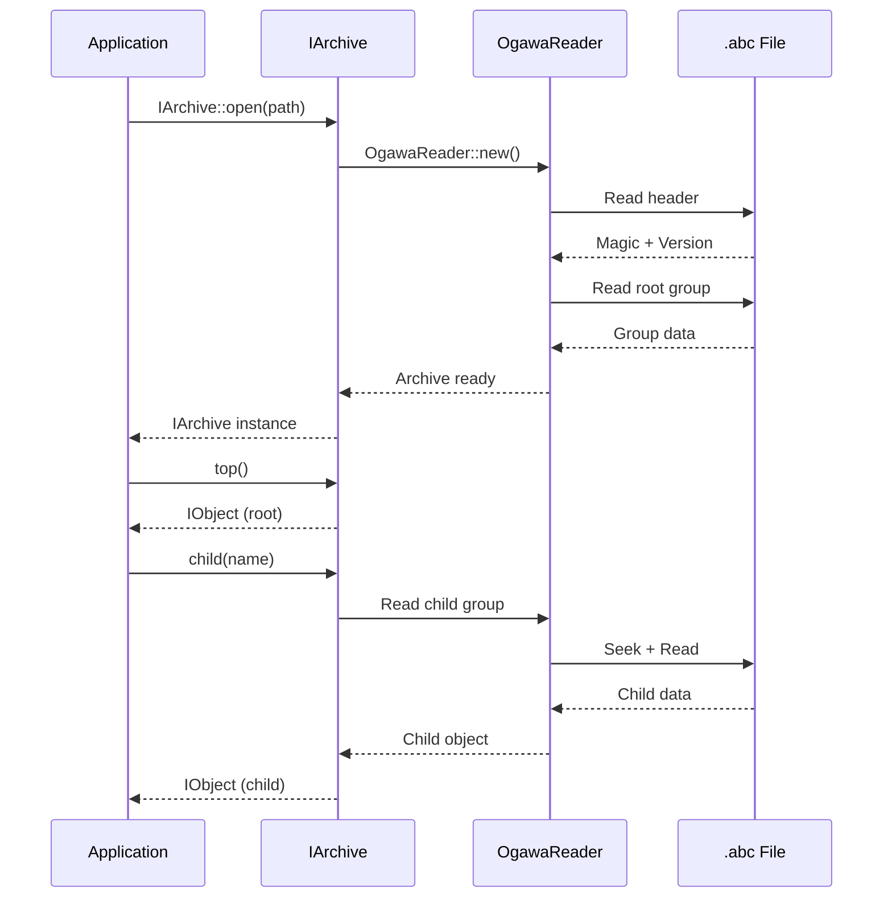
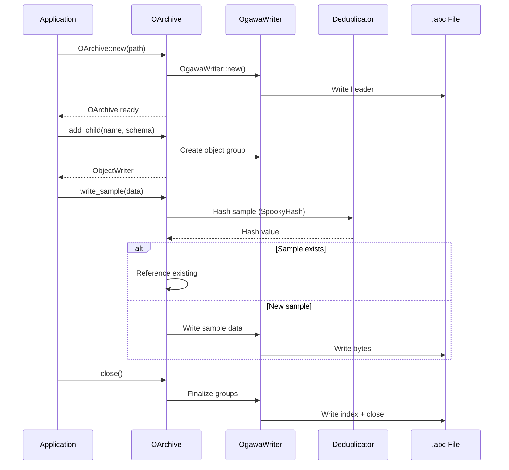
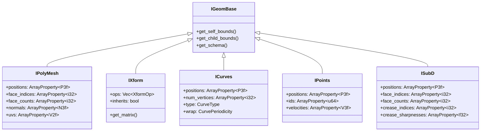
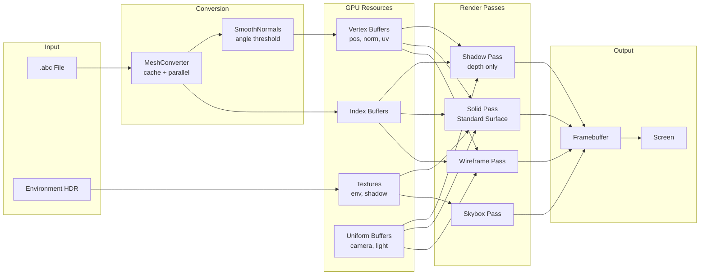
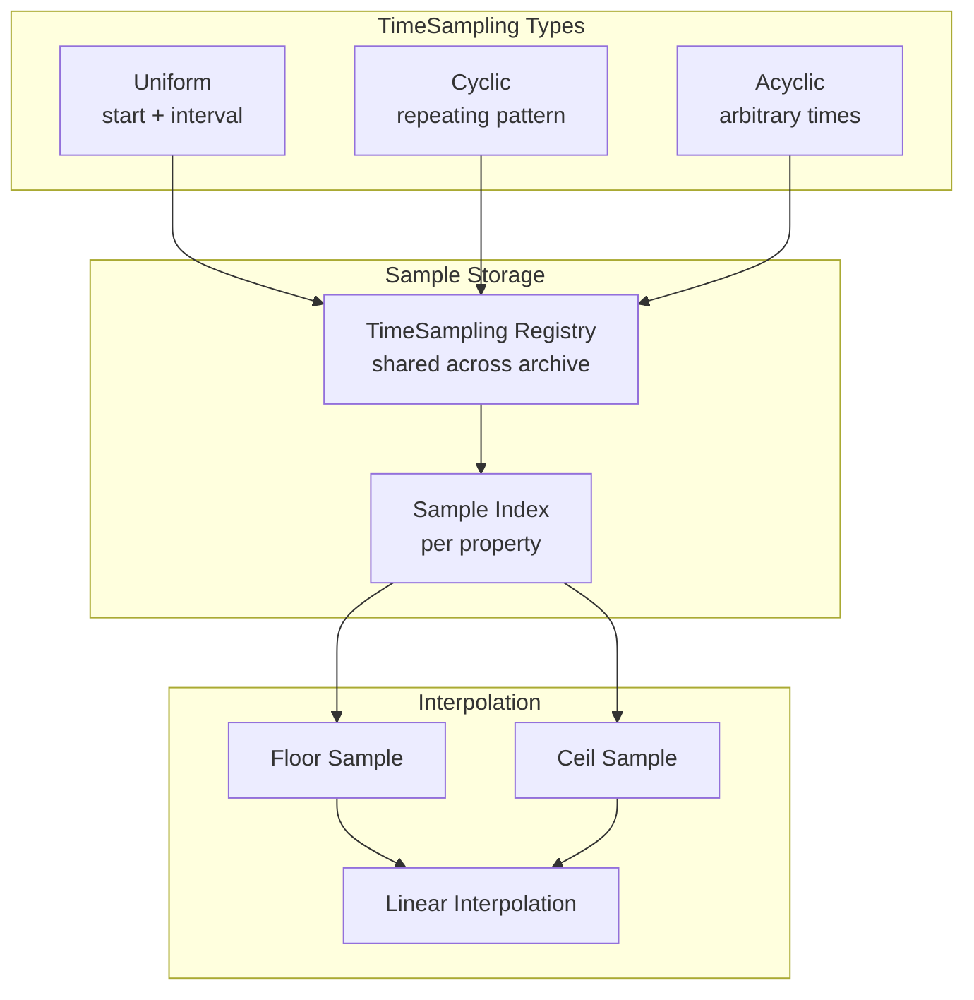
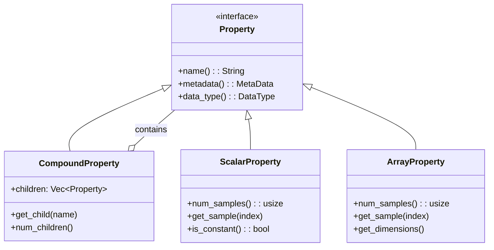
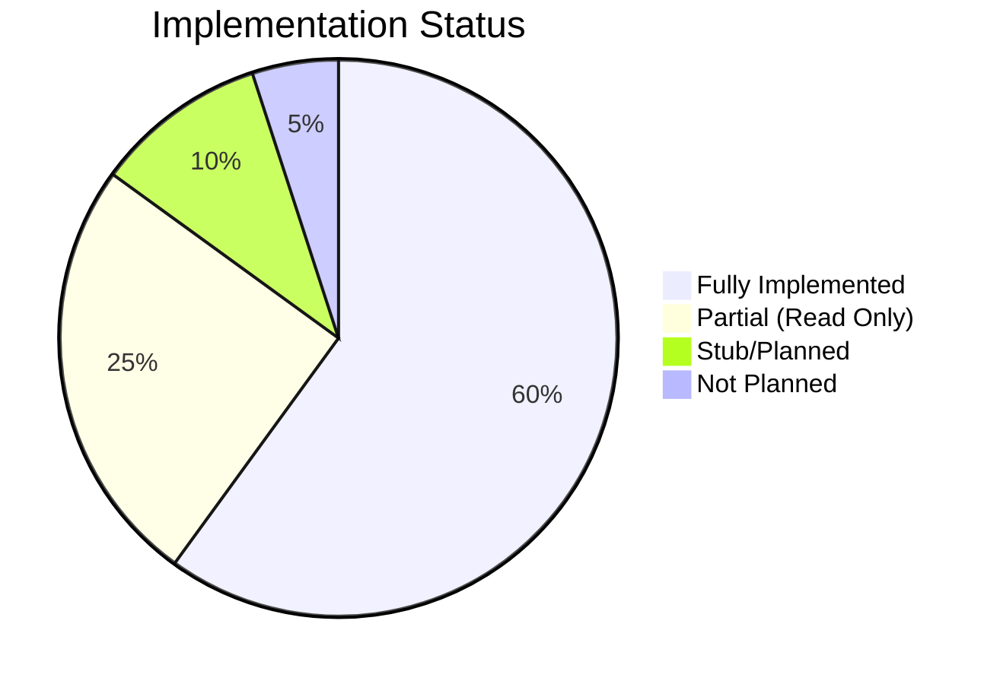
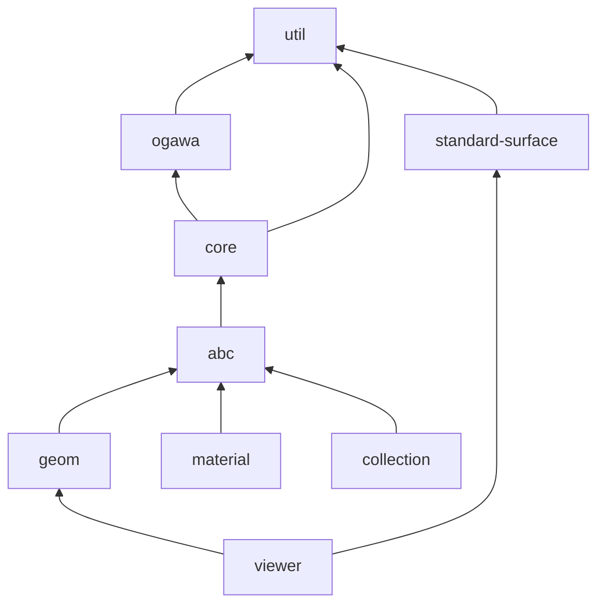

# Alembic-RS Architecture Diagrams

## 1. High-Level Module Structure

## 2. Ogawa File Format Structure

## 3. Reading Pipeline (IArchive)

## 4. Writing Pipeline (OArchive)

## 5. Geometry Schema Hierarchy

## 6. Viewer Render Pipeline

## 7. TimeSampling System

## 8. Property Type Hierarchy

## 9. Parity Status Overview

## 10. Module Dependencies

## Legend

| Symbol | Meaning |
|--------|---------|
| Solid Arrow | Direct dependency |
| Dashed Arrow | Optional dependency |
| Box | Module/Component |
| Diamond | Decision point |
| Cylinder | Data storage |
