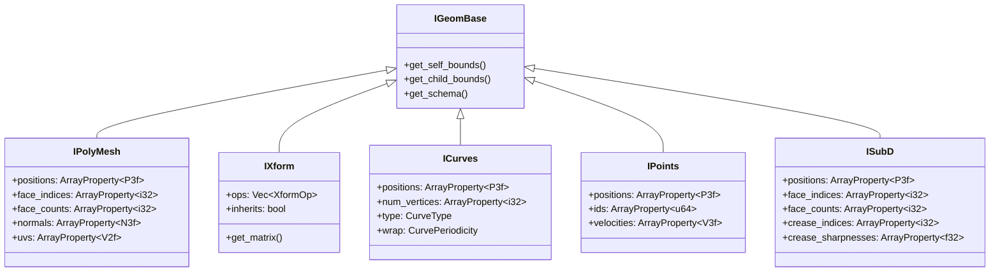

# Alembic-RS Architecture Diagrams

## 1. High-Level Module Structure


## 2. Ogawa File Format Structure


## 3. Reading Pipeline (IArchive)


## 4. Writing Pipeline (OArchive)


## 5. Writer Parity Order (Ogawa)


Note: time sampling tables use maxSamples = 1 for constant properties; archive metadata always includes _ai_AlembicVersion.

## 6. Geometry Schema Hierarchy



## 7. Viewer Render Pipeline


## 7. TimeSampling System


## 8. Property Type Hierarchy


## 9. Parity Status Overview


## 10. Module Dependencies


## 11. Output Schema Architecture (Fixed)


**Status**: ✅ FIXED - geom/mod.rs now re-exports types from ogawa/writer.rs.

## 12. Code Deduplication (Fixed)


**Status**: ✅ FIXED - Shared helpers added to OProperty. ~60 lines of duplicate code removed.

## 13. Read vs Write API (Fixed)


**Status**: ✅ FIXED - abc::OArchive now has write_archive() that delegates to ogawa.

## 14. Remaining Dead Code (Intentional)


## 15. Bug Hunt Findings (2026-01-20)

### Material Inheritance Bug Flow


**Location:** `src/viewer/mesh_converter.rs:588-598`

### Viewer Scene State Bug


**Location:** `src/viewer/app.rs:1466-1477`

### Python Object Traversal Performance

```mermaid
flowchart TD
    A[Python: obj.getProperty] --> B[Rust: with_object()]
    B --> C[Get archive root]
    C --> D[Split path into parts]
    D --> E[Loop: for each part]
    E --> F[Find child by name]
    F --> G[Navigate to child]
    G --> E
    E --> H[Finally access property]

    style B fill:#f99
    style E fill:#f99

    Note1[Every method call<br/>repeats this entire flow!]
    Note1 -.-> B
```

**Location:** `src/python/object.rs:38-63`

### Dead Code Distribution


## 16. Bug Priority Matrix

```mermaid
quadrantChart
    title Bug Severity vs Fix Effort
    x-axis Easy Fix --> Hard Fix
    y-axis Low Impact --> High Impact
    quadrant-1 Do First
    quadrant-2 Plan Carefully
    quadrant-3 Quick Wins
    quadrant-4 Backlog

    Material Inheritance: [0.3, 0.9]
    Exit Bypass: [0.2, 0.85]
    Matrix Convention: [0.4, 0.8]
    Scene Refresh: [0.35, 0.65]
    Vertex Hash: [0.5, 0.6]
    CPU Usage: [0.25, 0.55]
    Python valid(): [0.15, 0.5]
    String Arrays: [0.6, 0.45]
    Missing Constructors: [0.3, 0.4]
    Dead Code: [0.4, 0.2]
    Code Duplication: [0.7, 0.3]
```

## Legend

| Symbol | Meaning |
|--------|---------|
| Solid Arrow | Direct dependency |
| Dashed Arrow | Optional dependency |
| Box | Module/Component |
| Diamond | Decision point |
| Cylinder | Data storage |
| Red fill | Problem/Issue |
| Green fill | Working/Correct |
| Yellow fill | Warning/Stub |
