# Viewer Render Pipeline - Mermaid Diagrams

## Render Path Decision

```mermaid
flowchart TD
    A[render()] --> B{show_wireframe?}
    B -->|Yes| C[render_opaque_pass<br/>wireframe pipeline]
    C --> Z[Submit & Return]
    
    B -->|No| D[Classify meshes by opacity]
    D --> E{effective_opacity<br/>>= 0.999?}
    
    E -->|Yes| F[opaque_mesh_names]
    E -->|No| G[transparent_meshes<br/>sorted back-to-front]
    
    F --> H[render_gbuffer_pass]
    H --> I{use_ssao?}
    I -->|Yes| J[render_ssao_pass]
    J --> K[render_ssao_blur_pass x2]
    K --> L[render_lighting_pass]
    I -->|No| L
    
    L --> M{has transparent?}
    G --> M
    
    M -->|Yes| N[render_transparent_pass]
    M -->|No| O[Submit]
    N --> O
```

## GBuffer Path Detail


## UV Coordinate Problem

```mermaid
flowchart TD
    subgraph Expected["Expected UV (Correct)"]
        E1["Top-Left<br/>clip(-1,+1) → UV(0,0)"]
        E2["Top-Right<br/>clip(+1,+1) → UV(1,0)"]
        E3["Bottom-Left<br/>clip(-1,-1) → UV(0,1)"]
        E4["Bottom-Right<br/>clip(+1,-1) → UV(1,1)"]
    end
    
    subgraph Current["Current UV (BROKEN)"]
        C1["Top-Left<br/>clip(-1,+1) → UV(1,1) ❌"]
        C2["Top-Right<br/>clip(+1,+1) → UV(0,1) ❌"]
        C3["Bottom-Left<br/>clip(-1,-1) → UV(1,0) ❌"]
        C4["Bottom-Right<br/>clip(+1,-1) → UV(0,0) ❌"]
    end
    
    Expected -.->|"Image rotated<br/>180 degrees"| Current
```



## Data Flow

```mermaid
sequenceDiagram
    participant UI as egui UI
    participant VP as Viewport
    participant R as Renderer
    participant GPU as GPU Passes
    
    UI->>VP: show()
    VP->>VP: handle_input()
    VP->>VP: ensure_render_texture()
    VP->>R: update_camera()
    VP->>R: render()
    
    R->>R: classify meshes by opacity
    
    alt opacity >= 0.999 (GBuffer Path)
        R->>GPU: render_shadow_pass()
        R->>GPU: render_gbuffer_pass()
        R->>GPU: render_ssao_pass()
        R->>GPU: render_lighting_pass()
        Note over GPU: ⚠️ BROKEN UV coords!
    else opacity < 0.999 (Transparent Path)
        R->>GPU: render_transparent_pass()
        Note over GPU: ✓ Works correctly
    end
    
    R->>VP: return
    VP->>UI: draw texture
```



## File Dependencies


## Fix Location

```mermaid
graph LR
    subgraph Problem["🔴 Problem Location"]
        S[shaders.rs<br/>lines 21, 110, 157]
    end
    
    subgraph Fix["🟢 Fix Required"]
        F1["Change UV formula in<br/>vs_fullscreen()"]
        F2["out.uv = vec2<f32>(<br/>  pos.x * 0.5 + 0.5,<br/>  0.5 - pos.y * 0.5<br/>)"]
    end
    
    Problem --> Fix
```


